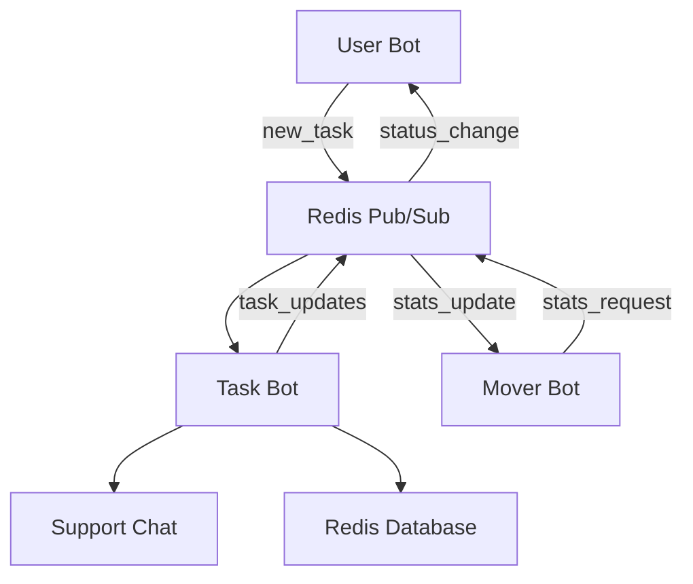

# Task Bot

Task Bot - это центральный компонент системы управления задачами, который обрабатывает задачи в чате поддержки и управляет их жизненным циклом.

## Основные функции

### 🎯 Управление задачами
- **Получение новых задач** от User Bot через Redis Pub/Sub
- **Присвоение уникальных номеров** каждой задаче
- **Публикация задач** в чат поддержки с интерактивными кнопками
- **Управление статусами**: unreacted → waiting → in_progress → completed

### 🔄 Жизненный цикл задачи

1. **Новая задача (unreacted)**
   - Кнопки: "⚡ Сделать задачей", "🗑️ Удалить"
   - Задача ожидает решения о том, станет ли она официальной задачей

2. **Ожидающая задача (waiting)**
   - Кнопки: "🔥 Взять в работу", "💬 Ответить", "🗑️ Удалить"
   - Задача готова к выполнению, ищет исполнителя

3. **Задача в работе (in_progress)**
   - Кнопки: "✅ Завершить", "💬 Ответить", "🔔 Напомнить"
   - Задача назначена исполнителю и находится в процессе выполнения

4. **Завершенная задача (completed)**
   - Кнопки: "🔄 Переоткрыть", "📊 Отчет"
   - Задача выполнена, но может быть переоткрыта при необходимости

### 👥 Управление исполнителями
- **Автоматическое назначение** исполнителя при взятии задачи в работу
- **Отслеживание статистики** по каждому исполнителю
- **Уведомления** о смене статуса задач

### 💬 Система ответов
- **Интерактивные ответы** через FSM (Finite State Machine)
- **Сохранение ответов** в базе данных с указанием автора
- **Отправка ответов** пользователям через User Bot

### 🔔 Система напоминаний
- **Настраиваемые интервалы** напоминаний (1ч, 4ч, 24ч)
- **Автоматическая отправка** напоминаний исполнителям
- **Проверка актуальности** задач перед отправкой напоминания

### 📊 Отчетность
- **Детальные отчеты** по каждой задаче
- **Статистика выполнения** по исполнителям
- **История изменений** статусов задач

## Архитектура

### Основные компоненты

```
task_bot/
├── task_bot.py          # Основной класс бота
├── main.py              # Точка входа для запуска
├── formatters.py        # Форматирование сообщений
├── keyboards.py         # Интерактивные клавиатуры
├── redis_manager.py     # Управление данными в Redis
├── pubsub_manager.py    # Pub/Sub коммуникация
└── handlers/            # Обработчики команд и callback'ов
    ├── commands.py
    └── callbacks.py
```

### Взаимодействие с другими компонентами



## Конфигурация

### Переменные окружения (.env)

```env
# Токен Task Bot
TASK_BOT_TOKEN=your_task_bot_token

# ID чата поддержки
SUPPORT_CHAT_ID=-1002269851341

# Redis настройки
REDIS_HOST=localhost
REDIS_PORT=6379
REDIS_DB=0
REDIS_PASSWORD=your_redis_password

# Интервалы (в секундах)
STATS_UPDATE_INTERVAL=30
REMINDER_CHECK_INTERVAL=3600
```

### Настройки в settings.py

```python
class Settings:
    # Telegram Bots
    TASK_BOT_TOKEN = os.getenv("TASK_BOT_TOKEN")
    
    # Chat IDs
    SUPPORT_CHAT_ID = int(os.getenv("SUPPORT_CHAT_ID"))
    
    # Intervals
    STATS_UPDATE_INTERVAL = int(os.getenv("STATS_UPDATE_INTERVAL", 30))
    REMINDER_CHECK_INTERVAL = int(os.getenv("REMINDER_CHECK_INTERVAL", 3600))
```

## Запуск

### Локальный запуск

```bash
# Из корневой директории проекта
python -m bots.task_bot.main

# Или из директории task_bot
cd bots/task_bot
python main.py
```

### Docker запуск

```dockerfile
FROM python:3.11-slim

WORKDIR /app
COPY requirements.txt .
RUN pip install -r requirements.txt

COPY . .

CMD ["python", "-m", "bots.task_bot.main"]
```

## API и интеграция

### Redis Pub/Sub каналы

#### Входящие каналы:
- `new_tasks` - новые задачи от User Bot
- `task_updates` - обновления задач от других компонентов

#### Исходящие каналы:
- `task_updates` - изменения статусов задач
- `reminders` - запросы на напоминания
- `stats_updates` - обновления статистики

### Структура данных задачи

```json
{
  "message_id": 12345,
  "chat_id": -1001234567890,
  "chat_title": "Test Chat",
  "chat_type": "supergroup",
  "user_id": 123456789,
  "first_name": "John",
  "last_name": "Doe",
  "username": "johndoe",
  "language_code": "en",
  "is_bot": false,
  "text": "Текст задачи",
  "status": "waiting",
  "task_number": 42,
  "assignee": "support_user",
  "task_link": "https://t.me/c/1234567890/123",
  "reply": "Ответ на задачу",
  "reply_author": "support_user",
  "reply_at": "2024-01-15T10:30:00",
  "created_at": "2024-01-15T10:00:00",
  "updated_at": "2024-01-15T10:30:00"
}
```

## Логирование

### Уровни логирования
- **INFO** - основные события (получение задач, смена статусов)
- **ERROR** - ошибки обработки
- **DEBUG** - детальная отладочная информация

### Файлы логов
- `logs/task_bot.log` - основной лог
- `logs/task_bot_errors.log` - только ошибки

### Пример логов

```
2024-01-15 10:00:00 - task_bot - INFO - Received new task event: task:20240115:1
2024-01-15 10:00:01 - task_bot - INFO - Processing new task: task:20240115:1
2024-01-15 10:00:02 - task_bot - INFO - Task task:20240115:1 published in support chat. Message ID: 123
2024-01-15 10:05:00 - task_bot - INFO - Callback from 123456789 for task task:20240115:1: status_waiting_task:20240115:1
2024-01-15 10:05:01 - task_bot - INFO - Updating task task:20240115:1 status to waiting
```

## Мониторинг и отладка

### Команды для отладки

```bash
# Проверка подключения к Redis
redis-cli ping

# Просмотр активных каналов Pub/Sub
redis-cli pubsub channels

# Мониторинг сообщений в канале
redis-cli subscribe new_tasks

# Просмотр задач в Redis
redis-cli keys "task:*"
redis-cli get "task:20240115:1"
```

### Метрики для мониторинга
- Количество обработанных задач
- Время отклика на новые задачи
- Количество ошибок обработки
- Использование памяти и CPU

## Безопасность

### Рекомендации
- Используйте отдельные токены для каждого бота
- Ограничьте доступ к Redis только необходимыми IP
- Регулярно ротируйте токены ботов
- Мониторьте логи на предмет подозрительной активности

### Валидация данных
- Проверка корректности ID чатов и пользователей
- Санитизация текста сообщений
- Ограничение размера сообщений и ответов

## Устранение неполадок

### Частые проблемы

1. **Бот не получает новые задачи**
   - Проверьте подключение к Redis
   - Убедитесь, что User Bot публикует события в канал `new_tasks`

2. **Кнопки не работают**
   - Проверьте права бота в чате поддержки
   - Убедитесь в корректности callback_data

3. **Ошибки при отправке сообщений**
   - Проверьте корректность SUPPORT_CHAT_ID
   - Убедитесь, что бот добавлен в чат поддержки

### Диагностические команды

```bash
# Проверка статуса бота
curl -X GET "https://api.telegram.org/bot<TOKEN>/getMe"

# Проверка подключения к Redis
python -c "import redis; r=redis.Redis(); print(r.ping())"

# Тест отправки сообщения
python -c "
import asyncio
from aiogram import Bot
bot = Bot(token='YOUR_TOKEN')
asyncio.run(bot.send_message(chat_id='CHAT_ID', text='Test'))
"
```

## Разработка и тестирование

### Настройка среды разработки

```bash
# Создание виртуального окружения
python -m venv venv
source venv/bin/activate  # Linux/Mac
venv\Scripts\activate     # Windows

# Установка зависимостей
pip install -r requirements.txt

# Запуск в режиме разработки
python -m bots.task_bot.main
```

### Тестирование

```bash
# Запуск тестов
python -m pytest tests/test_task_bot.py

# Тестирование с покрытием
python -m pytest --cov=bots.task_bot tests/
```

## Лицензия

MIT License - см. файл LICENSE в корне проекта.
